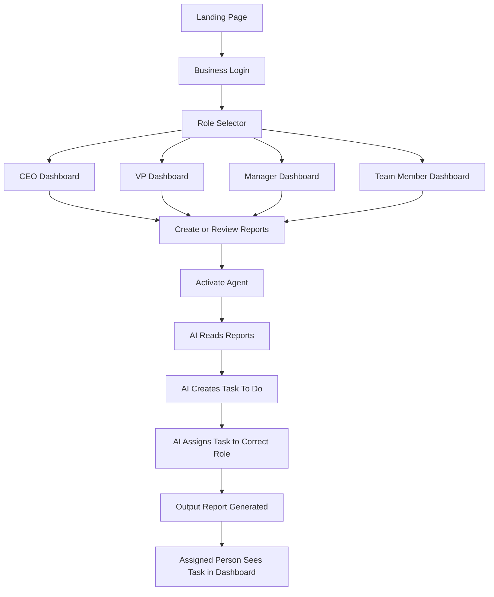
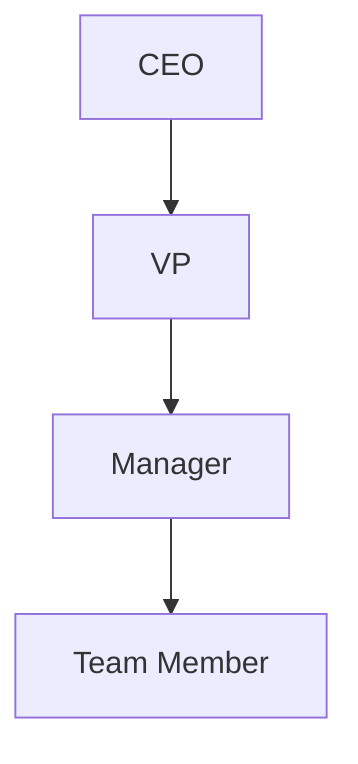
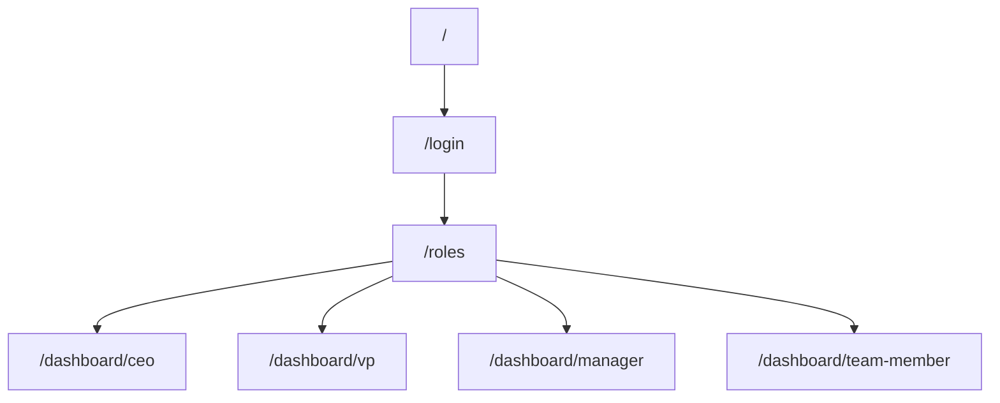
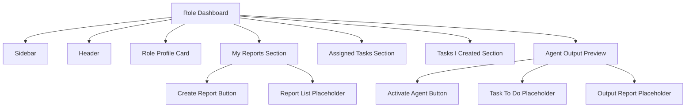
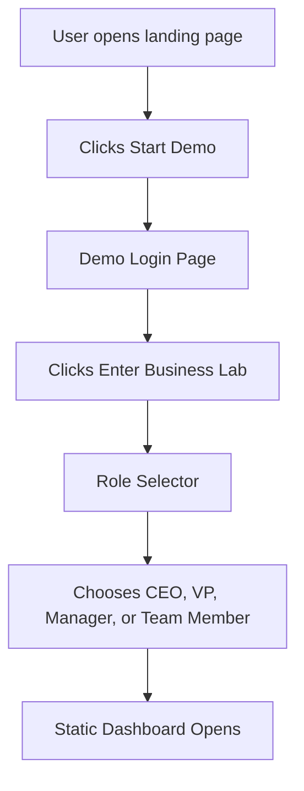
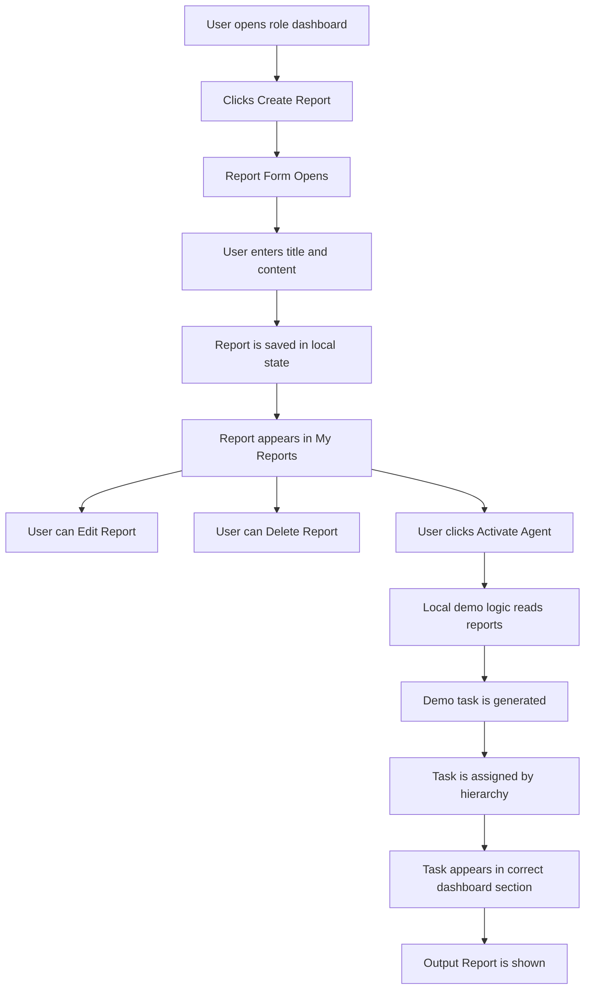
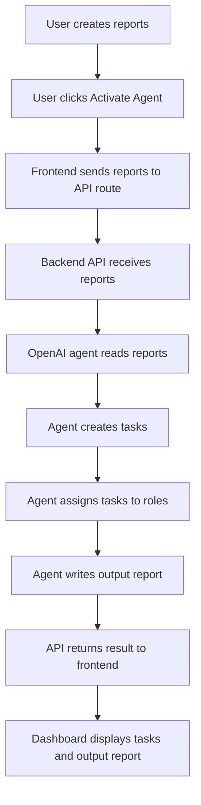
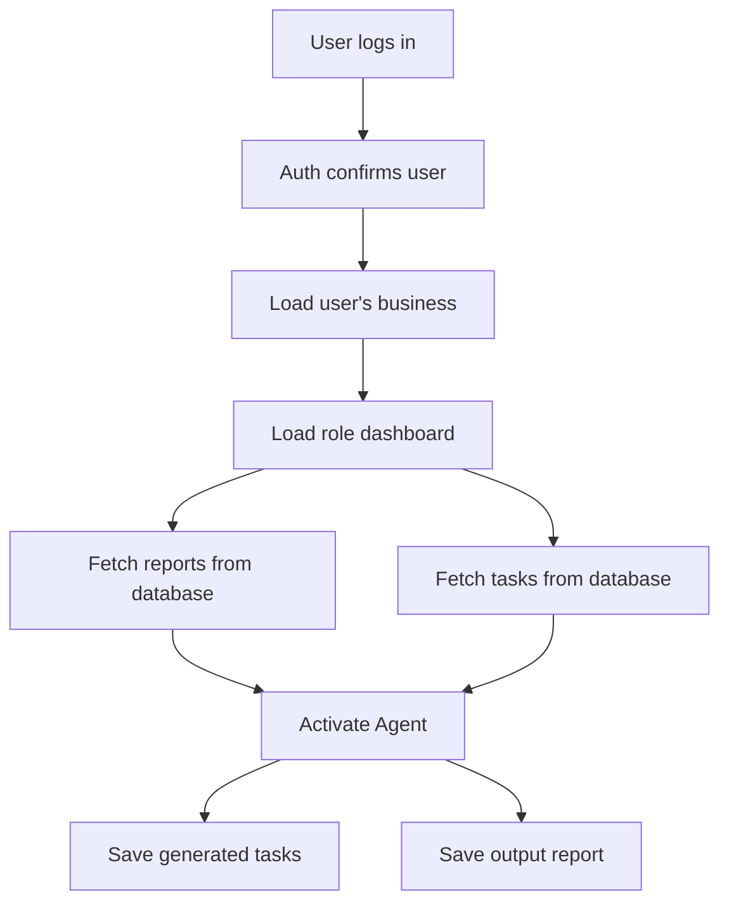

# Business Lab Flow Chart

Business Lab is an AI-powered internal business operating system for the chain:

```text
CEO -> VP -> Manager -> Team Member
```

The MVP proves one core idea:

```text
Business reports go in -> tasks, action plans, and output reports come out
```

## Main Product Flow



## Role Hierarchy



## Route Flow



## Dashboard Layout Flow

Each role dashboard has the same structure so the app stays simple and easy to understand.



## Phase 1 Flow

Phase 1 is frontend only.



Phase 1 includes:

- Landing page
- Demo login page
- Role selector page
- CEO dashboard
- VP dashboard
- Manager dashboard
- Team Member dashboard
- Static reports
- Static assigned tasks
- Static created tasks
- Agent placeholders

Phase 1 does not include:

- Real authentication
- Database
- Supabase
- OpenAI
- Backend API
- Real report saving

## Phase 2 Flow

Phase 2 adds local report and task behavior using React state.



Phase 2 should still avoid:

- Database
- Supabase
- OpenAI
- Real login

## Phase 3 Flow

Phase 3 adds backend API routes and real AI agent activation.



Phase 3 adds:

- API routes
- AI agent activation
- Report-to-task generation
- Output report generation

Phase 3 still can use temporary local/demo storage until the core flow works.

## Future Database Flow

This should come after the frontend and AI flow are clear.



Future database tables may include:

- businesses
- users
- roles
- reports
- tasks
- agent_runs
- output_reports

## Simple User Story

Example:

1. CEO logs in.
2. CEO opens the CEO dashboard.
3. CEO creates a report called "Quarterly Growth Direction".
4. CEO clicks "Activate Agent".
5. The agent reads the CEO report.
6. The agent creates a task: "Break growth direction into department goals".
7. The task is assigned to the VP.
8. VP sees the assigned task in the VP dashboard.
9. VP creates their own department report.
10. The chain continues down to Manager and Team Member.

## MVP Success Criteria

The MVP is successful when a judge or viewer can understand this flow:

```text
Reports -> Agent -> Tasks -> Assigned Roles -> Output Report
```

The app does not need to be perfect. It needs to clearly prove the product idea.
